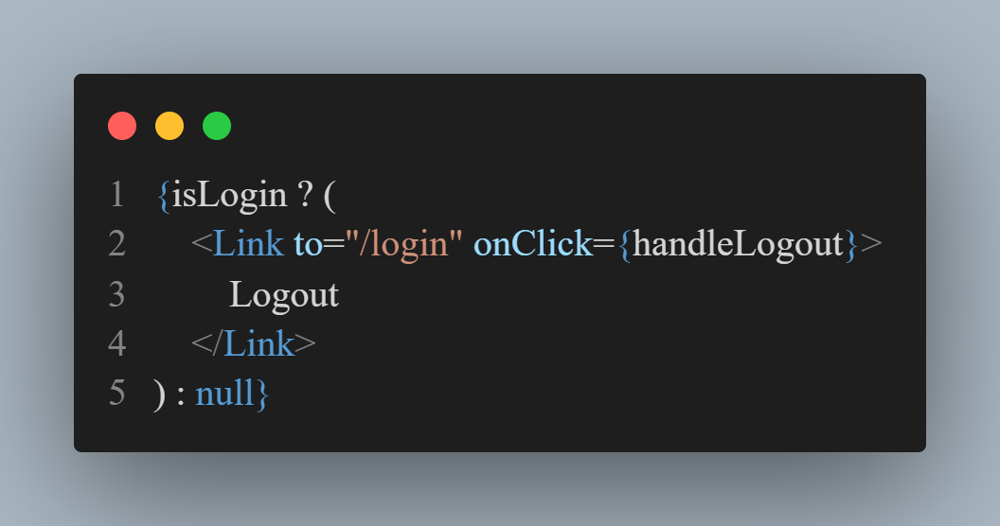

<!-- Headings -->

# Heading 1

## Heading 2

### Heading3

#### Heading4

##### Heading 5

###### Heaing6

<!-- Italics -->

_This text is_ Italic
_This text_ is Italic

<!-- Strong -->

**This Text** is Strong

<!-- Strike Through -->

~~This text~~ is StrikeThrough

<!-- Horizontal line -->

---

---

<!-- Blockquote -->

> This is a quote

<!-- Links -->

[Boivado](https://bomane.site/)

[Bomane.site](https://bomane.site 'Boivado')

<!-- ul -->

-   item 1
-   item 2
    -   nested item 2

<!-- ol -->

1. item 1
2. item 2

<!-- inline code block
-->

`<p>This is a paragraph </p>`

<!-- Images -->




<!-- Github Markdowns -->

<!-- Code Blocks -->

```bash
  npm install

  npm start
```

```javascript
function add(num1, num2) {
    return num1 + num2;
}
```

```Python
  def add(num1, num2)
    return num1 + num 2
```

<!-- Tables -->

| name     | email             |
| -------- | ----------------- |
| John Doe | johnD@gmail.com   |
| boivado  | boivado@gmail.com |

<!-- Task List -->

-   [x] Task 1
-   [x] Task 2
-   [] Task 3
